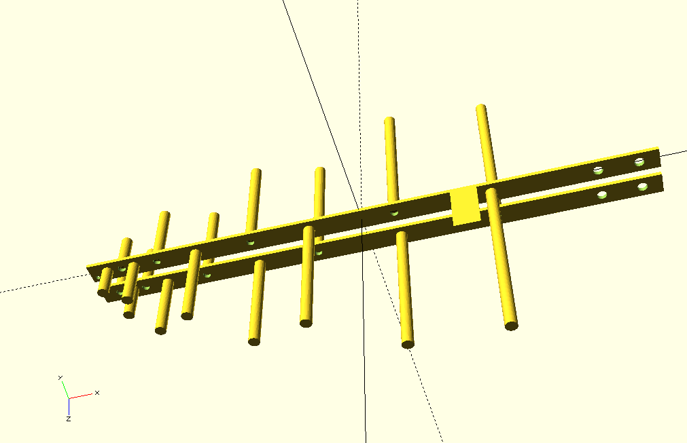

# lp_4g_lte_ant

* OpenSCAD model of a log periodic antenna for 3G/4G/LTE 
* Based on Andrew McNeil's measurements in his YouTube(r) video [Log Periodic Antenna 3G 4G LTE 850MHz to 2.7GHz](https://www.youtube.com/watch?v=IgloDJYZKLI)

